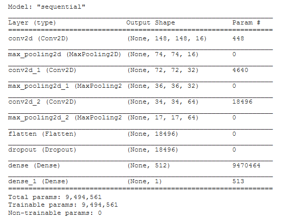
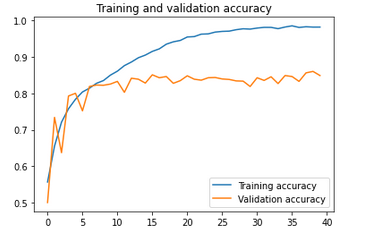
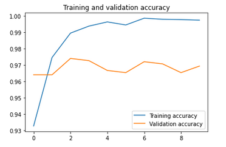

# Convolutional-Image-Recognition

## Introduction

In 2013, Kaggle hosted one of their favorite for-fun competitions:  Dogs vs. Cats. 
Much has since changed in the machine learning landscape, particularly in deep learning and image analysis. 
Back then, a tensor flow was the diffusion of the creamer in a bored mathematician's cup of coffee. 
Now, even the cucumber farmers are neural netting their way to a bounty.

At that time, the [literature](http://xenon.stanford.edu/~pgolle/papers/dogcat.pdf) suggested machine classifiers can score about 82.7% accuracy on this task.

## Model

Today, we experiment using the full Kaggle dataset (12,500 for dogs and 12,500 for cats)
to build a simple Convolutional Neural Network for illustrating the Image Recognition task.

## Performance

Our simple 3 level CNN model achieves 85% accuracy.

We can easily apply Transfer Learning to achieve 97% accuracy,
but it is out of scope of this work.

